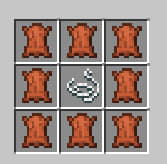

# 🎒 Рюкзаки

На сервере есть система рюкзаков. Чтобы получить себе рюкзак выложите крафт:

<figure><figcaption></figcaption></figure>

Также можно скрафтить цветной рюкзак заменив нить на краситель (или изумруд)

<figure><figcaption></figcaption></figure>

Чтобы надеть рюкзак возьмите его в правую руку, а чтобы открыть - тыкните пкм по воздуху и откройте инвентарь. Закрыть - также пкм по воздуху
