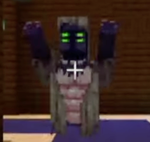

# Хранитель

Хранитель - это босс-моб в Мании, которого необходимо победить, чтобы продвинуться дальше.

_Расфиженый пудж с момом и пятью рапирами_

## Поведение

Хранитель - первый босс, с которым вам предстоит сразиться в Мании, и находится он в мавзолее. Во время боя босс может выполнить 6 атак:

* Ударяет кулаками по земле, поднимая игроков в воздух (эту атаку можно избежать прыжком).
* Заряжаемый  удар в стену приводит к падению блоков с потолка.
* Плюется кислотой в игроков.
* Вызывает 1-3 теневых стражей, чтобы убить игрока.
* Вызывает щупальца в форме буквы X рядом с игроком.
* Призывает пламеня безумия, которое взорвётся через несколько секунд.

Изменение для фазы 2:

После того как полоска здоровья хранителя достигнет 0, начнется вторая фаза боя босса, полоска здоровья восстановится до полной, глаза станут зелеными, а над головой появится ритуальная сигила.

* Он атакует чаще (75% каждые 2 секунды по сравнению с 50% каждые 5 секунд).
* Кислотная атака теперь также вызывает щупальца, лежащие под ней в виде волны.
* Он может выполнять новую лазерную атаку, вызывающую по всей арене медленно вращающийся луч кислоты.

Хранитель устойчив к огню, яду и иссушению, кроме того, арена хранителя укреплена камнем, чтобы игроки не смогли его обмануть. После смерти хранитель призывает на свое место теневых стражей, из него выпадает сочащееся ядро (необходимое для развития), 5 древней кожи и 10 некроплазм, а также до 60 уровней опыта.

## Спавн

Арена хранителя находится в самой нижней комнате мавзолея, и вызвать хранителя можно, разорвав 4 цепи в комнате (для этого вам нужно иметь хотя бы 4-й уровень проницательности). После победы над хранителем эти цепи восстановятся, и вы сможете сразиться с ним снова.

## Мелочи

Во время переделки особняка хранитель выглядел совсем иначе, больше походя на синего инопланетного снежного человека с белым мехом.

<figure><figcaption></figcaption></figure>

Хранитель также является единственным способом найти теневых стражей.

## Примечание&#x20;

Здоровье - 1600x2 HP

Поведение - враждение

Классификация - босс

Уменьшение получаемого ими урона - 0.0

Место спавна - мавзолей
