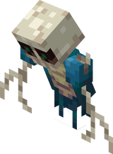
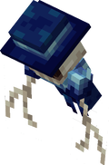

# Ревенант

Ревенанты - это призраки ада, которые появляются группами и обладают способностью к рывку.

<figure><figcaption></figcaption></figure>

## Поведение

Ревенанты охотятся на игрока группами. Они практически не получают урона от ударов, неустанно преследуют игроков и время от времени останавливаются, чтобы подготовиться к рывку. При убийстве из ревенантов выпадает 0-2 ретикулума.

## Спавн

Ревенанты появляются вокруг игроков, обезумевших в аду, или при поедании призрачной-трупной плоти. В незере они появляются стаями. Когда игроки сходят с ума, ревенантов время от времени заменяют грины, которые могут вызывать полчища ревенантов по своему желанию.

## Мелочи

Если вы назовете ревенанта «ElBones», он изменит свою текстуру в честь разработчика.

<figure><figcaption></figcaption></figure>

## Примечание&#x20;

Здоровье - 60 HP

Поведение - враждебны

Классификация - призрак

Уменьшение получаемого ими урона - 0.3

Место спавна - Ад
