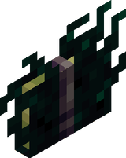

# Гримуар

Гримуар — это маниакальный предмет, используемый в качестве путеводителя по всему, что касается Мании.

<figure><figcaption>
Закрытая
</figcaption></figure>

<figure><figcaption>
Открытая
</figcaption></figure>

## Получение

Ее можно найти у оккультных идолов в виде плавающей книги, порождающей призраков, если схватить её, купить у бессонницы или если вы посетили не менее трех оккультных идолов<mark style="color:orange;">.</mark>

## Применение

Держа гримуар, вы можете использовать правую кнопку мыши для перелистывания страниц, а также shift и правую кнопку мыши для выбора страницы. Дополнительные главы можно открыть, выполнив соответствующий ритуал.

## Примечание

Предмет возобновляемый.

Нельзя помещать больше одного в слот.

редкость ???
