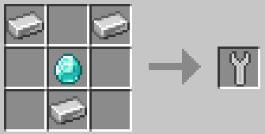
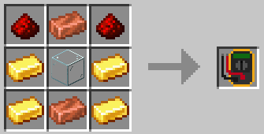
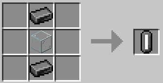
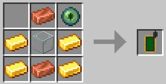

# 🔨 Инструменты

#### Гаечный ключ

Гаечный ключ — очень важный инструмент, который понадобится каждому человеку. У него есть 2 применения: Shift + щелчок ПКМ гаечным ключом, чтобы сломать машину и вернуть ее в форму предмета (обычная поломка без гаечного ключа уничтожает ее). Щелкните правой кнопкой мыши, чтобы выполнить изменение машины. Это действие зависит от машины, но обычно оно вращает ее.

| Элемент      | Рецепт                                            | Предметы                                              |
| ------------ | ------------------------------------------------- | ----------------------------------------------------- |
| Гаечный ключ |  | <ul><li>x3 Железный слиток</li><li>x1 Алмаз</li></ul> |

#### Мультиметр

Мультиметр — отличный инструмент для проверки вашей энергосистемы. Щелчок правой кнопкой мыши мультиметром на устройстве приведет к распечатке различной информации в чате. Для большинства машин это количество энергии, которую они в настоящее время хранят, но некоторые машины также имеют дополнительную информацию. Shift+щелкните правой кнопкой мыши мультиметром, чтобы переключить состояние элемента управления красным камнем. Большинство машин можно отключить с помощью красного камня, но по умолчанию используется «состояние отсутствия контроля красного камня». С помощью мультиметра измените состояние на «Управление красным камнем включено» или «Управление красным камнем включено – инвертировано».

| Элемент    | Рецепт                                              | Предметы                                                                                           |
| ---------- | --------------------------------------------------- | -------------------------------------------------------------------------------------------------- |
| Мультиметр |  | <ul><li>x4 Золотой слиток</li><li>x2 Редстоун</li><li>x2 Медный слиток</li><li>x1 Стекло</li></ul> |

#### Трубный ключ

Трубный ключ может переключать состояние ввода/вывода жидкости на стороне машины. Большинство машин вводят жидкости сбоку и выводят жидкости сверху и снизу. Используя трубный ключ, вы можете сделать вход сверху и выход на север (или в любое другое состояние).

| Элемент      | Рецепт                                                  | Предметы                                                       |
| ------------ | ------------------------------------------------------- | -------------------------------------------------------------- |
| Трубный ключ |  | <ul><li>x4 Железный слиток</li><li>x2 Красная краска</li></ul> |

#### Флакон

Флакон можно использовать для хранения жидкостей, например ведро. Однако он также может хранить газы, такие как пар, и может удерживать менее 1 ведра жидкости за раз (если в резервуаре 100 мл расплавленного железа, флакон может его собрать). Полезно для удаления небольших частиц жидкости, застрявших в машинах. Вы также можете выпить содержимое флакона, каким бы сомнительным оно ни было.

| Элемент | Рецепт                                    | Предметы                                               |
| ------- | ----------------------------------------- | ------------------------------------------------------ |
| Флакон  |  | <ul><li>x2 Стальной слиток</li><li>x1 Стекло</li></ul> |

#### GPS

Shift + щелчок ПКМ, чтобы сохранить местоположение целевого блока в GPS. Затем щелкните правой кнопкой мыши на машине, которой нужны координаты (например, Телепорт), чтобы перенести координаты на эту машину.

| Элемент | Рецепт                                   | Предметы                                                                                              |
| ------- | ---------------------------------------- | ----------------------------------------------------------------------------------------------------- |
| GPS     |  | <ul><li>x4 Золотой слиток</li><li>x2 Медный слиток</li><li>x1 Глаз Эндера</li><li>x1 Стекло</li></ul> |
