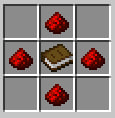

# 📗 Механическое руководство

«Руководство по механике» — это внутриигровое руководство по всем предметам в «Механизации», похожее на эту вики, но с дополнительным удобством! (Он также имеет тенденцию быть немного более современным). Вы должны получить его бесплатно при создании мира, но вы также можете создать его на ванильном верстаке или на машинном верстаке.

<figure><figcaption>
Крафт книги
</figcaption></figure>

Первая важная страница, с которой вы столкнетесь, — это страница «Приложения». Руководство разделено на несколько разделов, и на этой странице можно переключать разделы. Когда вы выберете и приложение, руководство закроется. Когда вы его снова откроете, там будет новая информация. 

#### Меню

После выбора «Приложения» вы увидите оглавление. Вы можете нажать на элемент, чтобы перейти на эту страницу.&#x20;

#### Страница

Страницы содержат три вещи: заголовок, описание элемента и зеленую стрелку внизу. Щелкнув зеленую стрелку, вы вернетесь к оглавлению. Наведите указатель мыши на заголовок, чтобы увидеть рецепт продукта. Кроме того, если вы щелкнете заголовок, рецепт отобразится в описании книги, поэтому вам не придется заново открывать книгу каждый раз, когда вы захотите увидеть рецепт.&#x20;
