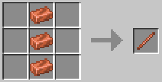
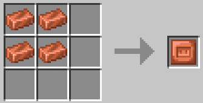
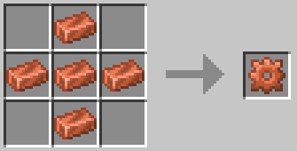

# ⚙️ Стержни, Пластины, Шестерни

Стержни, пластины и шестерни — это компоненты, используемые в большинстве рецептов механизации. Их можно изготовить из любого металла. Литейную ванну можно использовать для создания стержней, пластин и шестерен из металлов и других минералов, таких как алмаз. Кроме того, Литейную ванну можно модернизировать, чтобы снизить затраты на создание стержней, пластин и шестерен.

| Элемент | Рецепт                                    | Предметы          |
| ------- | ----------------------------------------- | ----------------- |
| Стержни |  | x3 Любого металла |

| Элемент  | Рецепт                                      | Предметы          |
| -------- | ------------------------------------------- | ----------------- |
| Пластины |  | x4 Любого металла |

| Элемент  | Рецепт                                      | Предметы          |
| -------- | ------------------------------------------- | ----------------- |
| Шестерни |  | x5 Любого металла |
