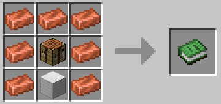

# 🛠️ Верстак для машиностроения

Верстак для машиностроения — это специальный верстак, используемый для изготовления машин и предметов в области механизации. Он немного отличается от обычного верстака тем, что предметы остаются внутри при выходе из графического интерфейса. Создается на ванильном верстаке.

<figure><figcaption></figcaption></figure>
