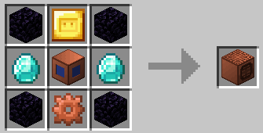

# Измельчитель

Измельчитель может использовать: 60 кВт для переработки различных материалов в альтернативные формы, в том числе

* руды и слитки -> необработанный металл
* бревна -> доски
* огненные стержни -> огненный порошок
* кости -> костная мука
* булыжник -> песок
* камень -> гравий
* гравий -> кремень

| Элемент      | Рецепт                                        | Предметы                                                                                                                                                    |
| ------------ | --------------------------------------------- | ----------------------------------------------------------------------------------------------------------------------------------------------------------- |
| Измельчитель |  | <ul><li>x4 Обсидиан</li><li>x2 Алмаз</li><li>x1 Ведро</li><li>x1 Золотая пластина</li><li>x1 Медная шестерня</li><li>x1 каркас машины 1-го уровня</li></ul> |

```
Улучшение машины: x2 Производство (не применяется к рудам, т.е. Железная руда -> Сырое железо)
Улучшение Эндера: x3 Производство
Улучшение Незера: Альтернативный выход, обычно переплавка предмета (т.е. руды -> слитки)
```
