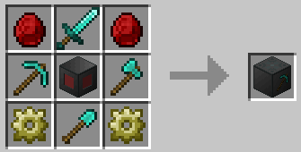
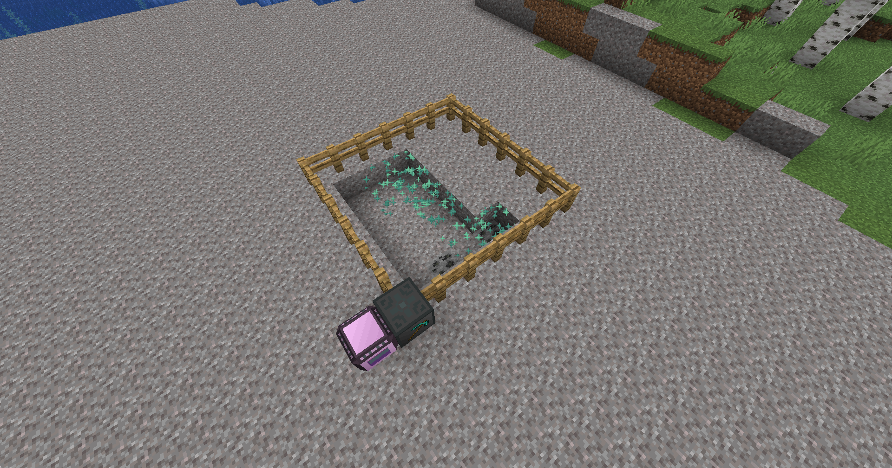

# Карьер

Карьер выкопает яму до скалы и сохранит все сломанные блоки в своем инвентаре. Чтобы обустроить Карьер, постройте прямоугольную зону заборов и замените один из угловых заборов Карьером. Затем щелкните правой кнопкой мыши карьер с помощью гаечного ключа, чтобы установить границу. Потребляет 64 кВт.

| Элемент       | Рецепт                                             | Предметы                                                                                                                                                                                                               |
| ------------- | -------------------------------------------------- | ---------------------------------------------------------------------------------------------------------------------------------------------------------------------------------------------------------------------- |
| Парогенератор |  | <ul><li>x2 Кристаллический композит</li><li>x2 проводящие шестерни</li><li>x1 Алмазный меч</li><li>x1 Алмазная кирка</li><li>x1 Алмазный топор</li><li>x1 Алмазная лопата</li><li>x1 рама машины 2-го уровня</li></ul> |

```
Улучшение машины: x2 скорость добычи
Улучшение Эндера: разрушает блоки шелковым касанием
Улучшение Незера: разрушает блоки с помощью удача 3
```

<figure><figcaption></figcaption></figure>
