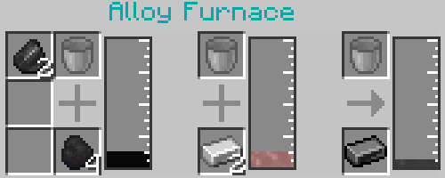
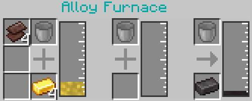

# Печь для сплавов

Из трех машин, необходимых для производства современных сплавов, печь для сплавов является самой важной. Он объединяет расплавленные ресурсы и предметы для создания расплавленных сплавов, которые можно отправить по трубе в литейный бассейн для создания слитков.

| Элемент       | Рецепт                                                     | Предметы                                                                                                                                           |
| ------------- | ---------------------------------------------------------- | -------------------------------------------------------------------------------------------------------------------------------------------------- |
| Сплавная печь |  | <ul><li>x4 кирпича</li><li>x2 Медная пластина</li><li>x1 блок красного камня</li><li>x1 Доменная печь</li><li>x1 рама машины 1-го уровня</li></ul> |

```
Улучшение машины: позволяет создавать сплавы 3-го уровня
Модернизация Эндера: 10% шанс удвоить количество Сплавов 2 уровня
Улучшение Незера: 10% шанс удвоить количество сплавов 3-го уровня
```

#### Обзор создания сплавов


Рецепты для печи для сплава:


| Сплав 2-го уровня        | Рецепт                                                                    | Предметы                                                                          |
| ------------------------ | ------------------------------------------------------------------------- | --------------------------------------------------------------------------------- |
| Стальной слиток          |                        | <ul><li>x2 Кремень</li><li>x4 Уголь</li><li>x2 Железный слиток</li></ul>          |
| Структурный слиток       |         | <ul><li>x4 Лазурит</li><li>x4 Кварц</li><li>x2 Оловянный слиток</li></ul>         |
| Проводящий слиток        |          | <ul><li>x16 Редстоун</li><li>x4 Медный слиток</li><li>x2 Золотой слиток</li></ul> |
| Кристаллический композит |  | <ul><li>x8 Аметист</li><li>x2 Алмаз</li><li>x2 Изумруд</li></ul>                  |

| Сплав 3-го уровня               | Рецепт                                                            | Предметы                                                                                                              |
| ------------------------------- | ----------------------------------------------------------------- | --------------------------------------------------------------------------------------------------------------------- |
| Титановый стальной слиток       |                | <ul><li>x4 Пылающий жезл</li><li>x2 Стальной слиток</li><li>x1 Титановый слиток</li></ul>                             |
| Армированный структурный слиток |  | <ul><li>x4 призмариновых кристалла</li><li>x2 Структурный слиток</li><li>x1 Титановый слиток</li></ul>                |
| Суперпроводящий слиток          |       | <ul><li>x4 Жемчужина Края</li><li>x2 Проводящий слиток</li><li>x1 Титановый слиток</li></ul>                          |
| Слиток Незера                   |                  | <ul><li>x1 Звезда Пустоты</li><li>4000л лавы (4 ведра)</li><li>x4 Титановый слиток</li></ul>                          |
| Эндерский слиток                |                   | <ul><li>x32 Фрукт коруса</li><li>x32 Дыхание Дракона</li><li>x4 Титановый слиток</li></ul>                            |
| Незеритовый слиток              |                      | <ul><li>x4 Незеритовый лом</li><li>x4 золотых слитка</li><li>10% шанс удвоиться с помощью Обновления Незера</li></ul> |
