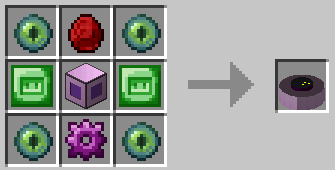

# Телепорт

Сохраните местоположение в телепортере с помощью [GPS](../bazovyi-modul/instrumenty.md). Затем встаньте на телепорт, чтобы телепортироваться в это место: телепорт назначения не требуется! Может быть нацелен на Незер и Край, но не на пользовательские измерения. Использует 1024 кДж/телепорт.

| Элемент  | Рецепт                                                | Предметы                                                                                                                                                                             |
| -------- | ----------------------------------------------------- | ------------------------------------------------------------------------------------------------------------------------------------------------------------------------------------ |
| Телепорт |  | <ul><li>x4 Глаз Эндера</li><li>x2 сверхпроводящие пластины</li><li>x1 Кристаллический композит</li><li>x1 снаряжение из сплава Эндера</li><li>x1 корпус машины 3-го уровня</li></ul> |
