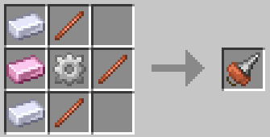

# Дрель

Дрель — мощный мультитул, способный добывать практически любой блок. Его нельзя зачаровать, но можно улучшить с помощью Шестерёнок (например, Железная Шестерёнка). Каждая шестерня имеет уникальные эффекты. Хотя сверло невозможно сломать, механизмы, использованные для его улучшения, обладают прочностью.

| Элемент | Рецепт                                       | Предметы                                                                                                              |
| ------- | -------------------------------------------- | --------------------------------------------------------------------------------------------------------------------- |
| Дрель   |  | <ul><li>x3 Медный жезл</li><li>x2 Оловянный слиток</li><li>x1 Титановый слиток</li><li>x1 Железный механизм</li></ul> |

| Материал шестерни         | Долговечность | Эффект обновления                                                           |
| ------------------------- | ------------- | --------------------------------------------------------------------------- |
| Железо                    | 1000          | +1 зона добычи полезных ископаемых                                          |
| Олово                     | 1000          | Нерушимость                                                                 |
| Медь                      | 1000          | +6 Скорость добычи полезных ископаемых                                      |
| Сталь                     | 3000          | +2 Зона добычи                                                              |
| Структурный               | 3000          | Нерушимый II                                                                |
| Проводящий                | 3000          | +11 Скорость добычи полезных ископаемых                                     |
| Титановая сталь           | 9000          | +3 Зона добычи                                                              |
| Армированный  структурный | 9000          | Нерушимый III                                                               |
| Супер проводящий          | 9000          | +21 Скорость добычи полезных ископаемых                                     |
| Золото                    | 250           | +16 Скорость добычи полезных ископаемых                                     |
| Незерит                   | 6000          | Нерушимый IV                                                                |
| Титан                     | 6000          | Магнитный                                                                   |
| Эндер                     | 9000          | Удача IV                                                                    |
| Пустота                   | 9000          | +4 Зона добычи                                                              |
| Уголь                     | 1000          | Мусор                                                                       |
| Обсидиан                  | 3000          | Мусор                                                                       |
| Изумруд                   | 3000          | Удача II                                                                    |
| Алмаз                     | 3000          | Удача II                                                                    |
| Редстоун                  | 3000          | Магнитный                                                                   |
| Ляпис                     | 3000          | Водный (ускоренная добыча под водой)                                        |
| Аметист                   | 3000          | Нежное прикосновение                                                        |
| Кристаллический композит  | 6000          | Удача III                                                                   |
| Светящийся камень         | 3000          | Подсветка (подсвечивает темные участки)                                     |
| Кварц                     | 3000          | Острота (урон +3)                                                           |
| Уран                      | 1000          | Авто Корюшка                                                                |
| Плутоний                  | 3000          | Авто Корюшка                                                                |
| Опыт                      | 3000          | Усиление (предотвращает повреждение других улучшений за счет долговечности) |
