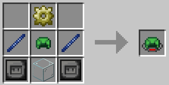
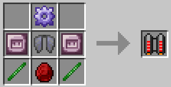

# Специальная броня

Специальная броня не обеспечивает защиту, а вместо этого дает особые способности, обычно за счет энергии портативной батареи. Их можно оснастить модульной броней в качестве улучшения.

| Элемент              | Эффект                                                                                                                                                | Рецепт                                                                    | Предметы                                                                                                                                                                                 |
| -------------------- | ----------------------------------------------------------------------------------------------------------------------------------------------------- | ------------------------------------------------------------------------- | ---------------------------------------------------------------------------------------------------------------------------------------------------------------------------------------- |
| Ребризер             | Дает бесконечное водное дыхание                                                                                                                       |                          | <ul><li>x2 структурных стержня</li><li>x2 стальные пластины</li><li>x1 Проводящий механизм</li><li>x1 Стекло</li><li>x1 Черепаховый шлем</li></ul>                                       |
| Очки ночного видения | Предоставляет бесконечное ночное видение                                                                                                              |  | <ul><li>x2 проводящих стержня</li><li>x2 стальные пластины</li><li>x1 Структурное снаряжение</li><li>x1 Известковое витражное стекло</li><li>x1 Железный шлем</li></ul>                  |
| Элитры               | Обычные элитры из Майнкрафта можно оборудовать в качестве апгрейда.                                                                                   | ------------------------                                                  | ------------------------                                                                                                                                                                 |
| Реактивный ранец     | Обеспечивает стабильный полет: посмотрите вверх/вниз, чтобы подняться вверх. Содержит эльтиру — посмотрите вниз и нажмите пробел, чтобы активировать. |                     | <ul><li>x2 титановые стальные пластины</li><li>x2 сверхпроводящих стержня</li><li>x1 усиленное структурное снаряжение</li><li>x1 Кристаллический композит</li><li>x1 Надкрылья</li></ul> |
| Ховер-сапоги         | Дает медленное падение после падения на небольшое расстояние.                                                                                         |                    | <ul><li>x2 стальные пластины</li><li>x2 Фантомные мембраны</li><li>x1 Проводящий механизм</li><li>x1 Структурное снаряжение</li><li>x1 Железные сапоги</li></ul>                         |
| Фазовые сапоги       | Позволяет проходить сквозь тонкую стену!                                                                                                              |                  | <ul><li>x2 слитка Эндера</li><li>x2 усиленных структурных стержня</li><li>x1 Титановая стальная пластина</li><li>x1 сверхпроводящее снаряжение</li><li>x1 Железные сапоги</li></ul>      |
